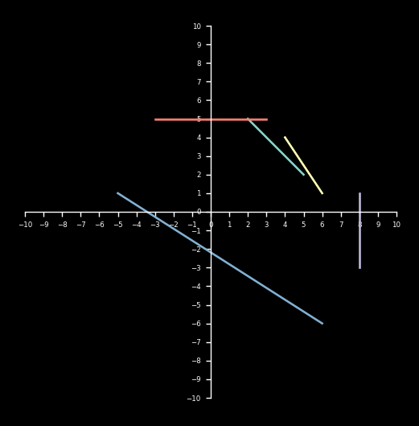
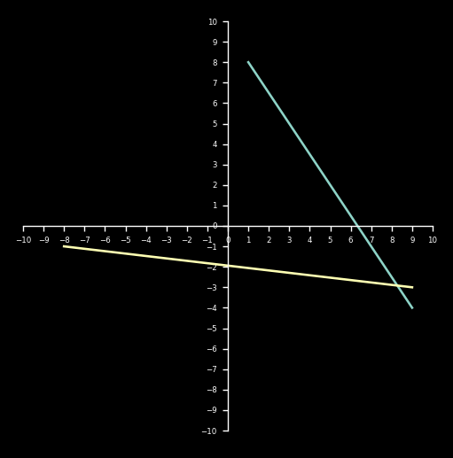

Given an array of line segments, check whether you can draw a line on a 3D plane.

Test case 1

Input: 
[[[2,5], [5,2]],
[[4,4], [6,1]],
[[8,1], [8,-3]],
[[-3,5], [3,5]],
[[-5,1], [6,-6]]]
expected: True

Test case 2

Input:
[[[1,8], [9,-4]],
[[-8,-1], [9,-3]]]
Expected: False

